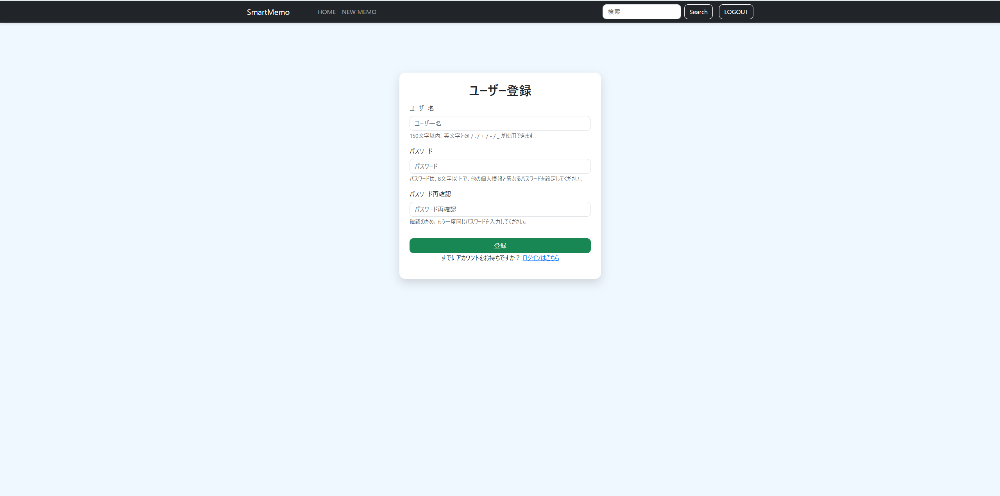

# SmartMemo Ver4.0

【アプリのスクリーンショット】

- ログイン画面

- メイン画面

- ログイン失敗時のアラート画面

- ユーザー登録画面

Django・Bootstrap・CSSで構築したシンプルなメモ管理Webアプリです。

## Ver4.0 更新内容
-  ユーザー登録（Sign Up）機能を追加
- UserCreationForm をカスタマイズ
-  RegisterForm を作成
- ユーザー登録画面を作成
- Bootstrap対応登録フォーム
- ログイン画面・登録画面のUIを統一
- ラベル・help_text を日本語化
- ログイン画面に「新規登録はこちら」を追加
- `{{ form.as_p }}` を卒業し、フォームを手動で作成

## Features(主な機能)
- Create memo
- Edit memo
- Delete memo
- Search memo
- Category support
- Category badges
- User registration (Sign Up)
- User authentication (Login / Logout)
- User-specific memo management
- Bootstrap UI
- Custom CSS

## Tech Stack
- Python
- Django
- Bootstrap 5
- CSS
- SQLite 
- Git
- GitHub

## Future Plans
- User registration (Sign Up)
- PostgreSQL migration
- Responsive UI improvements
- Markdown support
- Code syntax highlighting
- Dark mode

## 開発メモ
SmartMemoは、Djangoの学習とWebアプリケーション開発の理解を目的として開発しています。

現在も継続的に機能追加・改善を行い、バージョンアップを続けています。

将来的には、通常のメモだけでなく、コードも保存・管理できるメモアプリへ発展させる予定です。

  
