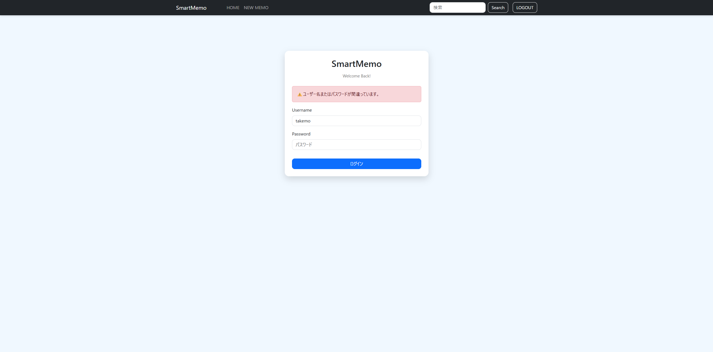

# SmartMemo Ver3.1

【アプリのスクリーンショット】

- ログイン画面

- メイン画面

- ログイン失敗時のアラート画面

Django・Bootstrap・CSSで構築したシンプルなメモ管理Webアプリです。

## Ver3.1で追加・改善した内容
- ✅ AuthenticationFormをカスタマイズ
- ✅ Bootstrap対応ログインフォーム
- ✅ ログイン失敗時のアラート表示

### 改善
- ✅ `{{ form.as_p }}` を卒業し、自分でフォームを作成
- ✅ カスタムCSSを追加
- ✅ Bootstrapデザインを適用
- ✅ 入力フォームを見やすく改善  

## Features(主な機能)
- Create memo
- Edit memo
- Delete memo
- Search memo
- Category support
- Category badges
- User authentication (Login / Logout)
- User-specific memo management
- Responsive navigation bar
- Bootstrap UI
- Custom CSS

## Tech Stack
- Python
- Django
- Bootstrap 5
- CSS3
- SQLite 
- Git
- GitHub

## Future Plans
- User registration (Sign Up)
- PostgreSQL migration
- Responsive UI improvements
- Markdown support
- Code syntax highlighting
- Dark mode

## Ver3.1　更新内容
- ✅ Custom CSSを追加
- ✅ Bootstrap + CSSによるUI改善
- ✅ ログイン画面をカードデザイン化
- ✅ AuthenticationFormをカスタマイズ
- ✅ Bootstrap対応ログインフォーム

## 開発メモ
SmartMemoは、Djangoの学習とWebアプリケーション開発の理解を目的として開発しています。

現在も継続的に機能追加・改善を行い、バージョンアップを続けています。

将来的には、通常のメモだけでなく、コードも保存・管理できるメモアプリへ発展させる予定です。

  
