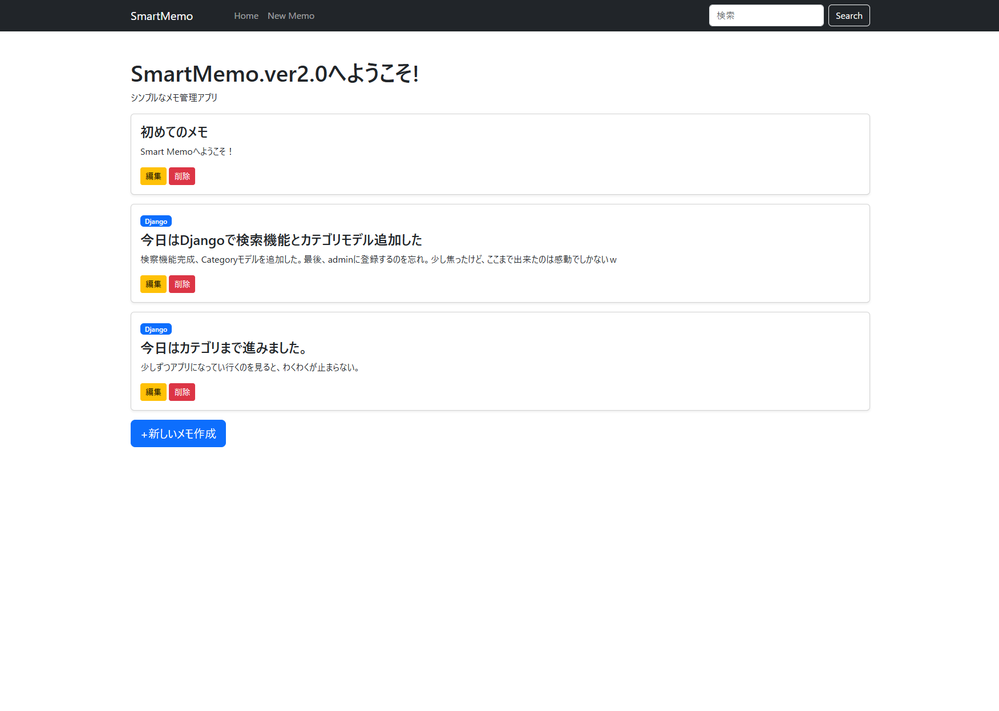

# SmartMemo Ver2.0

【アプリのスクリーンショット】

DjangoとBootstrapで構築したシンプルなメモアプリです。

## Features
- Create memo
- Edit memo
- Delete memo
- Search memo
- Category support
- Category badges
- Bootstrap UI
- Responsive navigation ber

## Tech Stack
- Python
- Django
- Bootstrap 5
- SQLite 
- Git
- GitHub

## Future Plans
- User authentication
- PostgreSQL migration
- Responsive UI improvements
- Pagination
- Dark mode

  ## Ver3.0で追加する機能
- ✅ナビゲーションバーを追加　完了！
- ✅検索機能 を追加　完了！
- ✅検索機能不具合を修正しました。原因（ダブルアンダーコアもう一個入れるのを忘れ）
- ✅カテゴリ機能
- ✅ログイン機能
- ✅ログアウト機能

  ## 開発メモ
 SmartMemoは、Djangoの学習とWebアプリケーション開発の理解を目的として開発しています。
現在も継続的に機能追加・改善を行い、バージョンアップを続けています。

将来的には、通常のメモだけでなく、コードも保存・管理できるメモアプリへ発展させる予定です。

  
